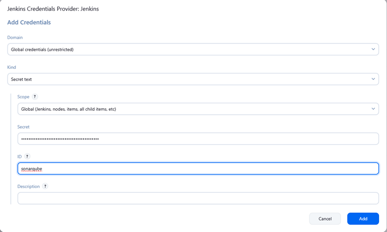
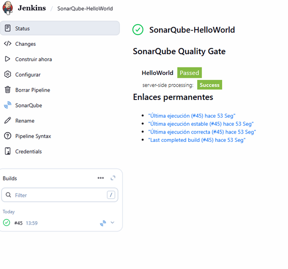
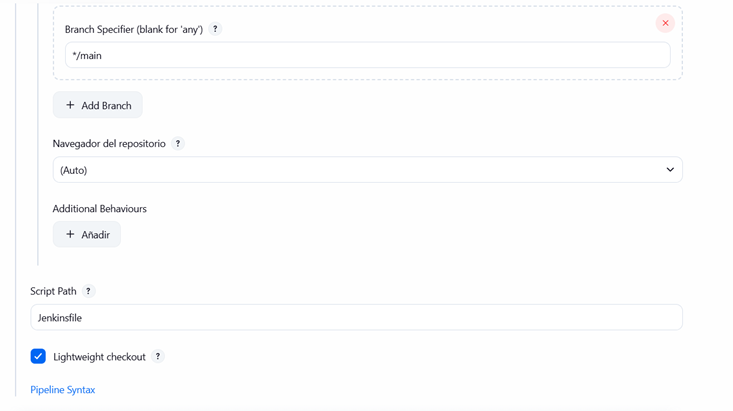
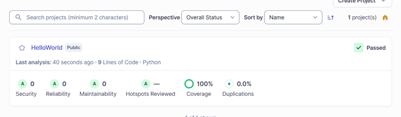
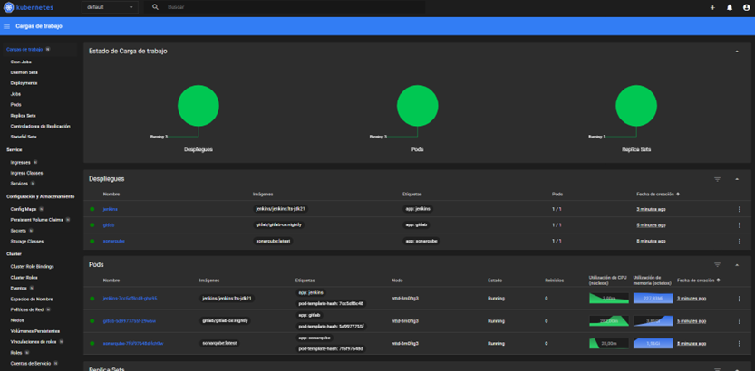
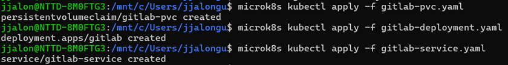
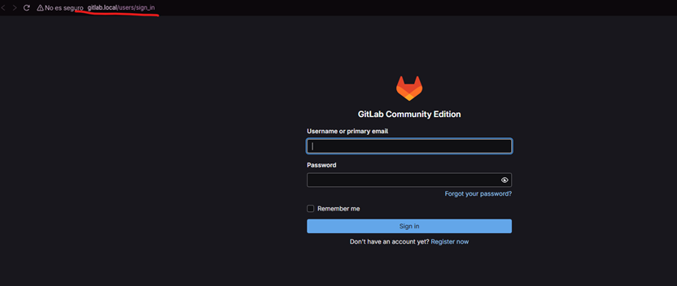
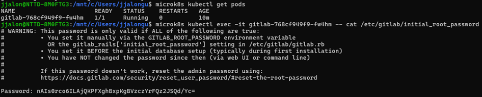
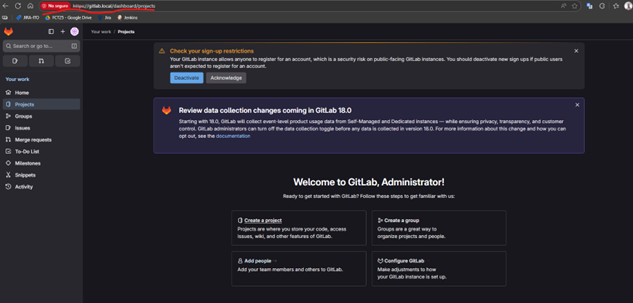
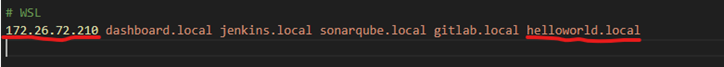

# Documentación Contenedores y Orquestadores
## Proyecto Python en Docker y SonarQube
#### Elementos utilizados
- **Plataforma de desarrollo:** WSL (Windows Subsystem for Linux)
  - Activar característica de WSL
  - Descargar consola de Ubuntu 22.04
- **Lenguaje / Frameworks:** Python 3.12, Flask.
- **Dependencias:** coverage, pysonar-scanner.
- **Entorno Virtual:** venv de python3
- **Servicios:** SonarQube (Docker), puerto 9001.
- **Archivos importantes:** app.py, test_app.py, coverage.xml, requirements.txt.
- **Imágenes de Docker:** SonarQube, Ubuntu 22.04
- **Contenedores de Docker:** SonarQube y HelloWorld (Proyecto de Python corriendo en Ubuntu 22.04).
- **Configuraciones:** variables de entorno, Dockerfile
#### Comandos
1. Intalar Docker
    1. Actualizar los paquetes:
     ```bash
         sudo apt update
     ```
    2. Instalar curl (comando para obtener el codigo fuente de una web):
     ```bash
         sudo apt install curl
     ```
    3. Añadir GPG y repositorios de Docker:
     ```bash
         curl -fsSL https://download.docker.com/linux/ubuntu/gpg | sudo gpg --dearmor -o /usr/share/keyrings/docker-archive-keyring.gpg
         echo "deb [arch=$(dpkg --print-architecture) signed-by=/usr/share/keyrings/docker-archive-keyring.gpg] https://download.docker.com/linux/ubuntu $(lsb_release -cs) stable" | sudo tee /etc/apt/sources.list.d/docker.list > /dev/null
     ```
     `curl`: Herramienta para transferir datos desde o hacia un servidor.  
     `-fsSl`: Descarga un archivo de forma silenciosa, siguiendo redirecciones y si falla no muestra el error.  
     `gpg`: Herramienta para cifrado y firmas digitales, en este caso verifica la autenticidad del repositorio.  
     `arch=$(dpkg --print-architecture)`: Detecta la arquitectura (amd64, arm64, etc.).  
     `signed-by=/usr/share/keyrings/docker-archive-keyring.gpg`: Usa la clave GPG descargada.  
     `$(lsb_release -cs)`: Detecta la versión de Ubuntu.   
    4. Actualizar los paquetes:
     ```bash
         sudo apt update
     ```
    5. Instalar Docker Cli (Motor de Docker, la herramienta para usar Docker desde la terminal y el runtime que ejecuta los contenedores.):
     ```bash
          sudo apt install docker-ce docker-ce-cli containerd.io
     ```
    6. Instalar Docker Compose (Instala el plugin oficial de Docker Compose para la CLI de Docker):
     ```bash
        sudo apt install docker-compose-plugin
     ```
    7. Ejecutar daemon de Docker (Ejecuta el daemon de docker en segundo plano):
     ```bash
        sudo dockerd &
     ```
    8. Inicio automatico de Docker (Asegura que Docker se inicie automáticamente cada vez que reinicies el sistema):
     ```bash
        sudo systemctl enable docker
        sudo systemctl start docker
     ```
    9. Añadir usuario al grupo de Docker:
     ```bash
        sudo usermod -aG docker $USER
     ```
3. Crear contenedor del proyecto HelloWorld
    1. Crear Dockerfile en el directorio del proyecto (HelloWorld)
    2. Crear imagen del proyecto:
     ```bash
        docker build -t helloworld .
     ```
     Construye una imagen con nombre 'helloworld' y contruira la imagen con los archivos del directorio actual.  
    3. Correr la imagen para crear un contenedor con la imagen creada:
     ```bash
        docker run -d -p 7000:4000 helloworld
     ```
    4. Acceder al contenedor mediante el navegador:
        http://localhost:7000
4.	Realizar pruebas unitarias para el proyecto:
    1.	Instalar coverage de python3 dentro del contenedor del proyecto
    ```bash
      docker exec -it <nombre_contenedor> sh
      pip3 install coverage
    ```
    2.	Crear archivo test_app.py, para realizar las pruebas del proyecto (importando la librería unittest)
    3.	Realizar las pruebas unitarias del proyecto:
    ```bash
      coverage run test_app.py
    ```
    4.	Informar las estadísticas de las pruebas (mejorando el código hasta llegar al 100%):
    ```bash
      $ coverage report
      Name            Stmts    Miss    Cover
      ---------------------------------------
      src/app.py          6       0     100%
      src/test_app.py     7       0     100%
      ---------------------------------------
      TOTAL              13       0     100%
    ```
    5.	Guardar las estadísticas en un xml
    ```bash
       coverage xml
    ```
5. Realizar pruebas unitarias en SonarQube
    1.	Instalar SonarQube en un contenedor de Docker
    ```bash
        docker run --name sonarqube -p 9001:9000 sonarqube
    ```
    2.	Acceder a SonarQube desde el navegador:
        http://localhost:9001
    3.	Accedemos a la consola para instalar python3 y pip3
    ```bash
        sudo apt install -y python3 python3-pip
    ```
    4.	Instalamos y activar en el entorno virtual
    ```bash
        python3  -m  venv venv
        source venv/bin/activate
    ```
    5.	Instalamos pysonar-scanner
    ```bash
        pip3 install pysonar-scanner
    ```
    6.	A continuación, vamos a conectar el proyecto a SonarQube
    ```bash
        pysonar -Dsonar.host.url=http://localhost:9001 \
        -Dsonar.sources=src \
        -Dsonar.python.coverage.reportPaths=coverage.xml \
        -Dsonar.projectKey=HelloWorld \
        -Dsonar.token=sqp_42be3b0fa7dd669b1fd8e33a51fbc71fa2526fa2
   ```
    `-Dsonar.host.url`: Url y puerto donde se encuentra alojado SonarQube  
    `-Dsonar.source`: Directorio donde se encuentran los archivos del proyecto  
    `-Dsonar.python.coverage.reportPaths`: Nombre del archivo de coverage que hemos realizado anteriormente  
    `-Dsonar.proyectKey`: Nombre de referencia del proyecto que se creara en SonarQube para los tests unitarios  
    `-Dsonar.token`: Token que hemos creado en SonarQube para que `pysonar` pueda acceder al directorio y pueda realizar los tests
   
Una vez realizado, en SonarQube nos aparecerá los siguientes valores de las pruebas unitarias realizadas con PySonar:


## Practica Python con Jenkins y SonarQube
#### Subir proyecto a repositorio de GitHub
1.	Instalamos y configuracion git en WSL:
    ```bash
      sudo apt install git -y
    ```
    1.	Configurar el nombre de usuario y correo del repositorio
    ```bash
      git config --global user.name "SemaJalon"
      git config --global user.email "j.jalon.guerrero@iescristobaldemonroy.es"
    ```
    2.	Crear repositorio en Github
        1.	Ir a GitHub.
        2.	Crear nuevo “New”
        3.	Ponerle un nombre al proyecto y elegir que sea público o privado

    3.	Subir proyecto al repositorio creado en Github
        1.	Ir al directorio local del proyecto
        ```bash
          cd helloworld
        ```
        2.	Inicializar Git:
        ```bash
          git init
        ```
        3.	Agregar los archivos:
        ```bash
          git add .
        ```
        4.	Realizar el primer commit
        ```bash
          git commit -m “subida de proyecto”
        ```
        5.	Conectar el repositorio local con el de GitHub
        ```bash
            git remote add origin https://github.com/SemaJalon/HelloWorld.git
        ```
        6.	Nos pediran el nombre de usuario y un token para confirmar la subida
          1.	Obtener token:
              Ire a GitHub → Settings → Developer settings → Personal access tokens → Tokens (classic) → Generate new token.  
              Elegir Expiration según prefiramos (yo he puesto 30 days).  
              Seleccionar los scopes:  
                  repo (para repositorios completos)  
              Hacer clic en Generate token y nos generara el token necesario  
          2.	Guardar el token en el pc local para no tener que volver a insertarlo:
        ```bash
            git config ––global credential.helper store
        ```
        7.	Subir los archivos al repositorio de GitHub:
        ```bash
            git Branch -M main
            git push -u origin main
        ```
#### Análisis de SonarQube con un pipeline de Jenkins
1. En el directorio raíz del proyecto de GitHub creamos un archivo Jenkinsfile para configurar el pipeline y los comandos necesarios para realizar las pruebas mediante pysonar. (En caso de necesitar el archivo Jenkinsfile, póngase en contacto con el autor del documento).
2. Conectar Jenkins con el repositorio de GitHub:
    1. Instalar plugin de GitHub:
        1. Administrar Jenkins -> Plugins -> Available plugins -> Buscar Git
    2. Creamos una nueva tarea y seleccionamos “Pipeline” e indicamos un nombre para la tarea:
       
    3. En la opción de Pipeline seleccionamos Git, introducimos la url del repositorio de GitHub y seleccionamos Add en la parte de Credentials para añadir las credenciales de GitHub  
         
       
3.	Conectar Jenkins con SonarQube
    1.	Instalamos el plugin de SonarQube Scanner en Jenkins:
        1.	Administrar Jenkins -> Plugins -> Availables plugins -> Buscamos SonarQube e instalamos SonarQube Scanner
    2.	Configurar plugin SonarQube:
        1.	Obtenemos un token de SonarQube:
            1.	Administration  System  Users  Apartado de Administrator creamos el token para Jenkins. 
            Copiamos el token que nos proporciona:
      
            2.	En Jenkins nos vamos a Administrar Jenkins -> System y nos desplazamos hasta la sección “SonarQube servers” y la configuramos indicando el nombre del servidor que hemos indicado en el archivo Jenkinsfile la url del servidor y añadimos las credenciales
      
                1.	Clicamos en “+Add” para añadir el token que hemos obtenido de SonarQube:  
                  
4.	Una vez conectado Jenkins con GitHub para obtener el repositorio y Jenkins con SonarQube, accedemos al pipeline que hemos creado y clicamos en “Construir ahora”  
       
5.	Por último, esperamos a que termine el análisis y veremos que se ha analizado con SonarQube.
      Lo podremos ver tanto en la página de SonarQube como en la de Jenkins:  
      SonarQube:  
        
    	Jenkins:  
    	  

## Analisis de SonarQube con un pipeline de Jenkins/Gitlab
1.	Creamos una instancia de GitLab Community Edition en docker
    ```bash
        docker pull gitlab/gitlab-ce:nightly
        docker run -p 8929:8929 -p 2424:22 -- name gitlab gitlab/gitlab-ce:nightly
    ```
2.	Entramos en la consola del contenedor de Gitlab y configuramos la url de acceso a la web y el puerto:
    ```bash
        docker exec -it -u root gitlab /bin/bash
        nano /etc/gitlab/gitlab.rb
    ```
    1.	Buscamos la línea external_url y la cambiamos por la siguiente línea:
  	```bash
        external_url http://localhost:8929
    ```
    2.	En el mismo archivo configuramos el puerto del ssh:
  	```bash
        gitlab_rails['gitlab_shell_ssh_port'] = 2424
    ```
    3.	Guardamos el archive y ejecutamos el siguiente comando para que se configure los cambios:
      	```bash
            gitlab-ctl reconfigure
        ```
        1.	Obtener la contraseña del usuario root:
  	```bash
        docker exec -it gitlab grep 'Password:' /etc/gitlab/initial_root_password
    ```
    4.	Una vez terminado la configuración en el navegador entramos en gitlab:  
        http://localhost:8929
3.	Subimos el proyecto a GitLab:
    1.	Ir al directorio local del proyecto
          ```bash
              cd helloworld
          ````
        1.	Inicializar Git:
          ```bash
              git init
          ```
        2.	Agregar los archivos:
          ```bash
              git add .
          ```
        3.	Realizar el primer commit
          ```bash
              git commit -m “subida de proyecto”
          ```
        4.	Conectar el repositorio local con el de GitLab
          ```bash
              git remote add origin http://gitlab:8929/root/sonarqube-helloworld.git
          ```
        5.	Nos pediran el nombre de usuario y la contraseña del usuario para confirmar la subida
            1.	Indicamos que el usuario es root y la contraseña que hemos obtenido anteriormente
        6.	Subir los archivos al repositorio de GitHub:
          ```bash
              git Branch -M main
              git push -u origin main
          ```
    2.	Creamos la pipeline en Jenkins y la conectamos con GitLab:
        1.	Añadimos las nuevas credentials para esta conexión con el nombre de usuario (root) y la contraseña que hemos obtenido anteriormente.  
              
            
    3.	En el archivo Jenkinsfile modificamos también las url y el nombre de credentialsId con el nombre que le hemos puesto a las credentials al crear la pipeline en Jenkins:
          ```
          pipeline {
              agent any
          
              environment {
                  SONARQUBE = 'sonarqube'   // nombre configurado en Jenkins -> System -> SonarQube servers
                  PYTHON_ENV = 'venv'
              }
          
              stages {
                  stage('Checkout') {
                      steps {
                          git branch: 'main',
                              url: 'https://github.com/SemaJalon/HelloWorld.git',
                              credentialsId: 'github-token'
                      }
                  }
          
          
                  stage('Setup Python Environment') {
                      steps {
                          sh '''
                              python3 -m venv venv
          
          
                          '''
                      }
                  }
          
          
                  stage('Run Tests') {
                      steps {
                          sh '''
                              python3 -m venv venv
                              . venv/bin/activate
                              /venv/bin/pysonar -Dsonar.host.url=http://sonarqube:9000 -Dsonar.sources=src -Dsonar.python.coverage.reportPaths=coverage.xml -Dsonar.projectKey=HelloWorld -Dsonar.token=sqp_42be3b0fa7dd669b1fd8e33a51fbc71fa2526fa2
                          '''
                      }
                  }
              }
          
              post {
                  success {
                      echo '✅ Pipeline completado correctamente.'
                  }
                  failure {
                      echo '❌ El pipeline ha fallado. Revisa las etapas anteriores.'
                  }
              }
          }
          ```
    4.	A continuación, le damos a “Contruir ahora” y esperamos a que se contruya y Pasen los test:
      
      

## Instalar Kubernetes
1.	Intalar kubernetes con microk8s
    ```bash
        sudo snap install microk8s -–classic
    ```
    1.	Iniciamos el servicio
    ```bash
        sudo microk8s status -–wait-ready
    ```
    2.	Comprovamos que nodo esté usando el kernel WSL2:
    ```bash
        sudo microk8s kubectl get node -o wide
    ```
    3.	Habilitamos los add-ons de DNS, Storage y Dashboard
    ```bash
        sudo microk8s enable dns
        sudo microk8s enable hostpath-storage
        sudo microk8s enable dashboard
    ```
    4.	Para acceder al dashboard, necesitamos el token y la dirección url:puerto, lo obtendremos con el siguiente comando:
    ```bash
        sudo microk8s dashboard-proxy
    ```
    5.	Copiamos el token que nos proporciona y lo pegamos aquí:
      

## Instalar instancia de Gitlab en Kubernetes con manifiestos
1.	Creamos los manifiestos:
    1. Volumen permanente (gitlab-pcv.yaml)
      ```bash
          # Version de la API
          apiVersion: v1
          # Tipo de recurso que se define
          kind: PersistentVolumeClaim
          # Metadatos del recurso, en este caso el nombre
          metadata:
            name: gitlab-pvc
          
          spec:
            # El volumen sera montado en modo Lectura/Escritura
            accessModes:
              - ReadWriteOnce
            resources:
              requests:
                # El tamaño del volumen sera de 10GiB
                storage: 10Gi
      ```
    2. Deployment (gitlab-deployment.yaml)
      ```bash
          # Version de la API
          apiVersion: apps/v1
          #Tipo de recurso que se define
          kind: Deployment
          # Metadatos del recurso, en este caso el nombre
          metadata:
            name: gitlab
          
          spec:
            # Cantidad de Pods que se desea ejecutar
            replicas: 1
            # Selector para identificar los Pods de este Deployment
            selector:
              matchLabels:
                app: gitlab
            # Plantilla que define las etiquetas que se le asignaran a los Pods de este Deployment
            template:
              metadata:
                labels:
                  app: gitlab
          
              spec:
                # Contenedores dentro del Pod
                containers:
                  - name: gitlab
                    # Imagen del contenedor obtenido desde Docker Hub
                    image: docker.io/gitlab/gitlab-ce:latest
                    # Puertos expuestos por el contenedor
                    ports:
                      - containerPort: 80
                      - containerPort: 443
                      - containerPort: 22
                    # Montaje del volumen persistente en el contenedor
                    volumeMounts:
                      - name: gitlab-storage
                        mountPath: /var/opt/gitlab
                # Volumenes para el Pod
                volumes:
                  - name: gitlab-storage
                    persistentVolumeClaim:
                      claimName: gitlab-pvc # PVC que se usara para la persistencia
      ```
    3. Servicio (gitlab-service.yaml)
      ```bash
          # Version de la API
          apiVersion: v1
          # Tipo de recurso, en este caso un servicio para los pods
          kind: Service
          # Metadatos del recurso, en este caso el nombre
          metadata:
            name: gitlab-service
          spec:
            # Tipo del servicio, NodePort expone el servicio en cada nodo del cluster en un puerto
            type: NodePort
            # Selector que indica qué Pods serán expuestos
            selector:
              app: gitlab
            # Puertos que se expondran dependiendo del protocolo
            ports:
              - name: http
                port: 80
                targetPort: 80
                nodePort: 30080
              - name: https
                port: 443
                targetPort: 443
                nodePort: 30443
              - name: ssh
                port: 22
                targetPort: 22
                nodePort: 30022
      ```
    4. Ingress (gitlab-ingress.yaml)
      ```bash
          # Version de la API
          apiVersion: networking.k8s.io/v1
          # Tipo del recurso, en este caso un Ingress (Acceso HTTP/S externo a los servicios del cluster)
          kind: Ingress
          # Metadatos del recurso, como el nombre y anotaciones del certificado a usar
          metadata:
            name: gitlab-ingress
            #annotations:
              #cert-manager.io/cluster-issuer: "letsencrypt-prod"
          spec:
            # Controlador de Ingress que usara, en este caso nginx
            ingressClassName: nginx
            # Configuracion de TLS para habilitar el HTTPS, la url sera http://gitlab.local
            # tls:
            #   - hosts:
            #       - gitlab.local
            #     secretName: gitlab-tls
            # Reglas de enrutamiento
            rules:
              # El host que resolvera para acceder al servicio
              - host: gitlab.local
                http:
                  paths:
                    - path: /
                      pathType: Prefix
                      backend:
                        service:
                          # Nombre del Servicio al que se redirige el trafico
                          name: gitlab-service
                          port:
                            # Puerto del servicio (HTTP)
                            number: 80
      ```
      
2.	Una vez creado todos los archivos los aplicamos:
  
  
3.	Una vez iniciado el servicio nos aparecerá en Kubernetes así:
  
4.	Despues nos vamos al archivo hosts de Windows para añadir el host de gitlab.local, para que lo podamos abrir desde el navegador de Windows:
    1.  Obtenemos la ip de wsl. En la consola de Windows ejecutamos lo siguiente
    
    2.  Nos vamos a C:\Windows\System32\drivers\etc:
    
5.	Ahora nos vamos al navegador de Windows (Microsoft Edge o el que tengais)
  
6.	El usuario es root y para obtener la contraseña ejecutaremos los siguientes comandos en wsl:
    1.	Obtener el nombre del pod en ejecución
    2.	Nos muestra la contraseña
      
7.	Y ya tendremos Gitlab montado en Kubernetes y listo para importar o realizar cualquier tarea necesaria:
      

## Instalar instancia de HelloWorld en Kubernetes
1.	Creamos los manifiestos:
    1.	Volumen permanente (hw-pcv.yaml) (Opcional)
      ```bash
          # Version de la API
          apiVersion: v1
          # Tipo de recurso que se define
          kind: PersistentVolumeClaim
          # Metadatos del recurso, en este caso el nombre
          metadata:
            name: helloworld-pvc
          
          spec:
            # El volumen sera montado en modo Lectura/Escritura
            accessModes:
              - ReadWriteOnce
            resources:
              requests:
                # El tamaño del volumen sera de 10GiB
                storage: 10G
      ```
    2.	Deployment (hw-deployment.yaml)
      ```bash
          # Version de la API
          apiVersion: apps/v1
          #Tipo de recurso que se define
          kind: Deployment
          # Metadatos del recurso, en este caso el nombre
          metadata:
            name: helloworld
          
          spec:
            # Cantidad de Pods que se desea ejecutar
            replicas: 1
            # Selector para identificar los Pods de este Deployment
            selector:
              matchLabels:
                app: helloworld
            # Plantilla que define las etiquetas que se le asignaran a los Pods de este Deployment
            template:
              metadata:
                labels:
                  app: helloworld
          
              spec:
                # Contenedores dentro del Pod
                containers:
                  - name: helloworld
                    # Imagen del contenedor obtenido desde Docker Hub
                    image: docker.io/jjalongu/helloworld:v2
                    # Ejecutar la aplicacion para que se pueda acceder
                    command:
                      - python3
                      - /app/src/app.py
                    # Puertos expuestos por el contenedor
                    ports:
                      - containerPort: 80
                    # Montaje del volumen persistente en el contenedor
                    volumeMounts:
                      - name: helloworld-storage
                        mountPath: /var/opt/helloworld
                # Volumenes para el Pod
                volumes:
                  - name: helloworld-storage
                    persistentVolumeClaim:
                      claimName: helloworld-pvc # PVC que se usara para la persistencia
      ```
    3.	Servicio (hw-service.yaml)
      ```bash
          # Version de la API
          apiVersion: v1
          # Tipo de recurso, en este caso un servicio para los pods
          kind: Service
          # Metadatos del recurso, en este caso el nombre
          metadata:
            name: helloworld-service
          spec:
            # Tipo del servicio, NodePort expone el servicio en cada nodo del cluster en un puerto
            type: NodePort
            # Selector que indica qué Pods serán expuestos
            selector:
              app: helloworld
            # Puertos que se expondran dependiendo del protocolo
            ports:
              - name: http
                port: 80
                targetPort: 80
      ```
    4.	Ingress (hw-ingress.yaml)
      ```bash
          # Version de la API
          apiVersion: networking.k8s.io/v1
          # Tipo del recurso, en este caso un Ingress (Acceso HTTP/S externo a los servicios del cluster)
          kind: Ingress
          # Metadatos del recurso, como el nombre y anotaciones del certificado a usar
          metadata:
            name: helloworld-ingress
          
          spec:
            # Controlador de Ingress que usara, en este caso nginx
            ingressClassName: nginx
            rules:
              # El host que resolvera para acceder al servicio
              - host: helloworld.local
                http:
                  paths:
                    - path: /
                      pathType: Prefix
                      backend:
                        service:
                          # Nombre del Servicio al que se redirige el trafico
                          name: helloworld-service
                          port:
                            # Puerto del servicio (HTTP)
                            number: 80
      ```
2.	Una vez creado todos los archivos los aplicamos:
  
3.	En el archivo C:\Windows\System32\drivers\etc\hosts añadimos el dominio helloworld.local:
  
4.	Una vez este activo el contenedor y el pod, accedemos a la url http://helloworld.local
  
